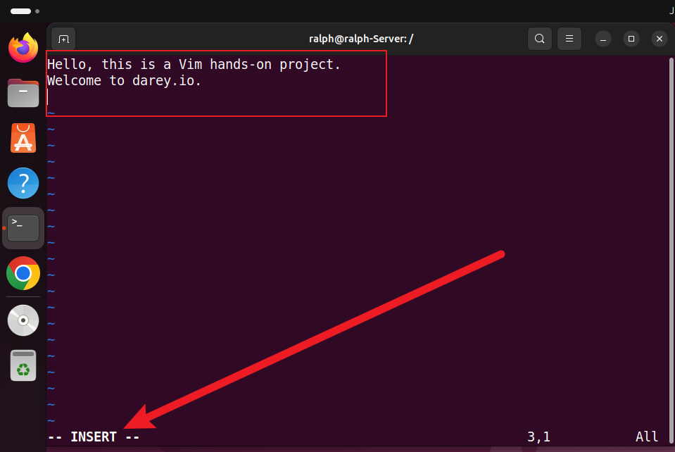

# Linux_Text_Editor

A Linux text editor is a software application specifically designed for creating, modifying, and managing text files on a Linux-based operating system. Text editors play a crucial role in the Linux environment, providing a means for users to interact with and manipulate plain text files, configuration files, scripts, and other text-based documents.

There are various text editors available in the Linux ecosystem, each with its own set of features and user interface. Let's dive in to the use of some text editors.

## VIM Text Editor

The Linux Vim text editor, short for "Vi Improved," is a powerful and versatile text editing tool deeply ingrained in the Unix and Linux ecosystems. Vim builds upon the foundation of the original Vi editor, offering an extensive set of features, modes, and commands that empower users to manipulate text efficiently. While Vim has a steeper learning curve compared to simpler editors like Nano, its capabilities make it a favourite among tech professionals and anyone working extensively with text files.

### Working With VIM Editor

Let's get our hand on vim

Open a new file named "exercise.txt" using the following command:

- Open a new file named "exercise.txt" using the following command:

`vim exercise.txt`

The command above creates a `exercise.txt` even if it doesn't exist. Then it opens the file up so that we can start writing into it. Its just like opening up Notepad file on Windows.

- **Enter Insert Mode** to edit the file.

- Press i to enter Insert mode.

- Type the following text into the file:

`Hello, this is a Vim hands-on project.
Welcome to darey.io.`

**Moving Around:** Navigate through the text using the arrow keys or h (left), j (down), k (up), and l (right).

**Deleting a Character:** Press esc on your keyboard to exit the insert mode. Position the cursor on a character you want to delete and press x.

**Deleting a Line:** To delete an entire line in the file, ensure that you are not in the insert mode. If you are in the insert mode, simple press the esc key as above. Then, place the cursor on a line, and press d twice on your keyboard to delete the entire line.

**Undoing Changes:** Make a change (add or delete text) in Insert or Normal Mode, then press Esc to enter Normal Mode and press u to undo the last change.

**Saving Changes:** After you have finished writing into the file, press esc, then type :wq and press Enter. This will save the file. w means write and q means quit which basically quits the vim mode and retunrs back to the terminal.

**Quitting Without Saving:** Incase you do not intend to save the file, simply press esc, then type :q! and press Enter to quit without saving changes.

## Nano Text Editor

Among Linux text editors, Nano stands out as a user-friendly and straightforward tool, making it an excellent choice for users who are new to the command line or those who prefer a more intuitive editing experience. Nano serves as a versatile and lightweight text editor, ideal for performing quick edits, writing scripts, or making configuration changes directly from the command line. Its intuitive command set simplifies text manipulation tasks, allowing users to navigate through files, insert or delete text, and save changes effortlessly. Nano's ease of use extends to its keyboard shortcuts, making it accessible even to those unfamiliar with intricate command sequences. With Nano, users can focus on the content of their text files without the distraction of a complex interface, making it a go-to choice for a wide range of users, from beginners to experienced Linux enthusiasts.

### Working With Nano Editor

**Opening a File:** named "nano_project.txt" using the following command:

`nano nano_project.txt`

You'll enter the Nano editor interface.

Entering and Editing Text: Type a few lines of text into the file. Nano has a simple interface, and you can start typing immediately.

Saving Changes: Save your changes by pressing Ctrl + O. Nano will prompt you to confirm the filename; press Enter to confirm.

Exiting Nano: If you wish to exit nano without saving the file, simply press Ctrl + X. If you have unsaved changes, Nano will prompt you to save before exiting.

Opening an Existing File: Open an existing file (if available) using the following command:

`nano existing_file.txt`

